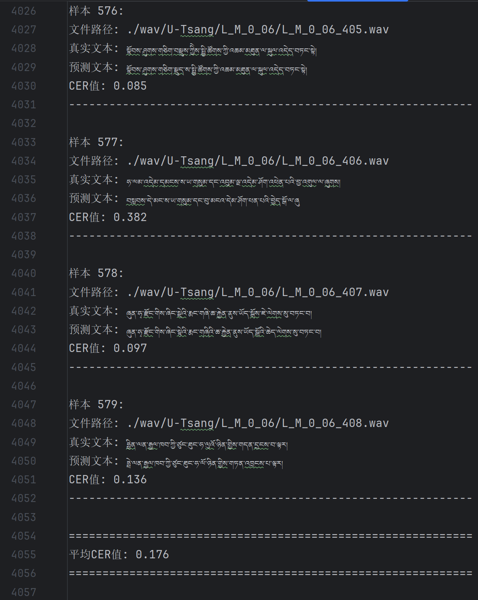
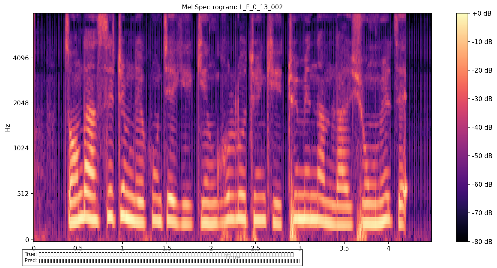
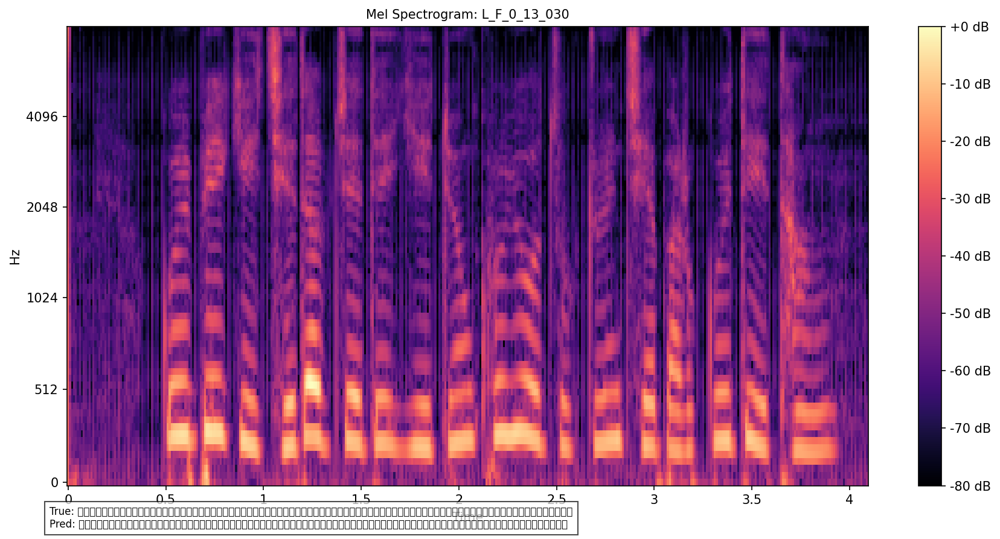

# 藏语语音识别模型

## 简介
如今,藏族地区很多人只能听说藏语,并不会写.并且很多历史文化传统都是口口相传,并没有纸质记载,所以藏语语音识别模型是很有必要的.加上藏汉文本互译也能满足藏族与汉族之间的交流,稳固民族团结.

## 模型的训练
基于 Whisper+LoRA/AdaLora 构建参数高效微调框架，仅训练 Transformer 关键模块（k_proj/q_proj 等），结合 8 位量化与 FP16 混合精度.

设计AudioAugmentPipeline与augment_audio双增强链路，支持噪声注入（30% 概率添加高斯白噪声）、变速（0.9-1.1 倍速随机调整）、音量调节、音频裁剪等 8 种增强策略，通过配置文件（augment_config_path）实现增强策略灵活开关，同时开发mask_audio_segments模块，对 15% 的音频片段进行静音 / 白噪声遮盖，提升模型对音频缺失、干扰场景的鲁棒性。

使用TTS合成数据,在原本的数据中加入了10%的合成数据,来扩充数据集.

## 运行环境

python                  3.9.0  
pytorch                 2.7.0  
transformers            4.31.0  
librosa                 0.11.0  

你可以使用以下命令
···
pip install librosa==0.11.0
···

CPU版本
···
pip install torch==2.7.0 torchvision==0.18.0 torchaudio==2.7.0 --index-url https://download.pytorch.org/whl/cpu
···

GPU版本
···
pip install torch==2.7.0 torchvision==0.18.0 torchaudio==2.7.0 --index-url https://download.pytorch.org/whl/cu118
···

## 效果

在完全陌生的数据集（测试数据集均没有在训练及评估数据集上出现过）上cer为17.6%

## 模型下载
模型已上传至huggingface

[模型地址](https://huggingface.co/unwang/tibetan_ASR_small/tree/main)

## mel图谱

## 模型的训练
训练模型使用的所有数据集都是公开数据集

模型训练有n多个版本,base\small\mudium各个大小

目前仍然在训练更新中
